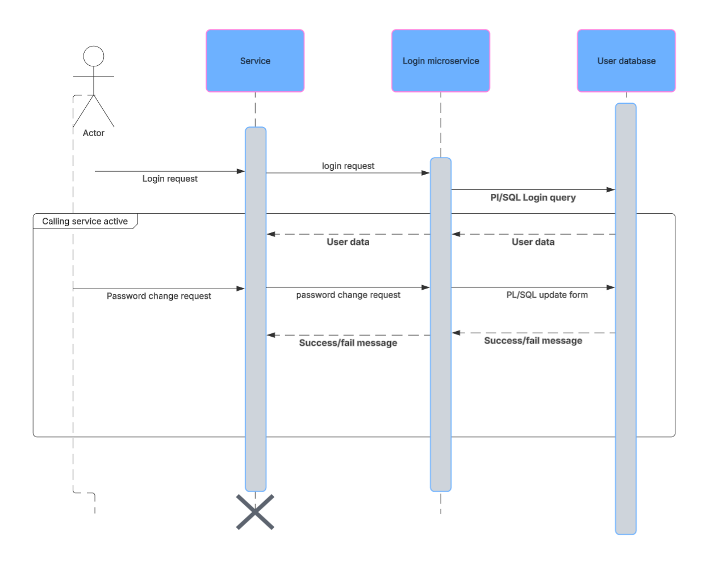
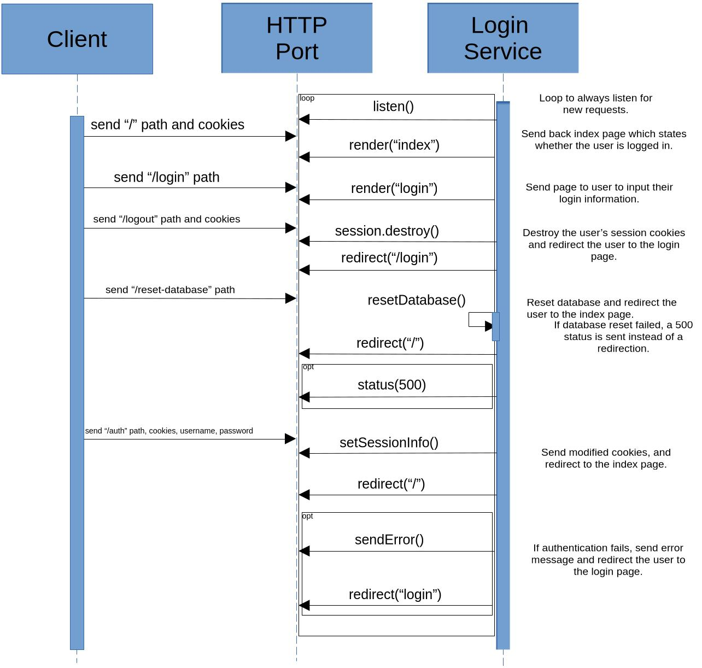

This is the login verification service repo for sprint 2.

Communication contract:
    To REQUEST:
        NYI
    To RECEIVE:
        NYI


# Communication Contract

### Requesting Data

Requesting data is done through an HTTP request. The path of the request is used
to specify an action with the request:

GET Requests:
- `/`: No request body, session information (cookies) are read.
- `/login`: No request body, only the path is required.
- `/logout`: No request body, session information (cookies) are modified.

POST Requests:
- `/reset-database`: No request body, only the path is required.
- `/auth`: Body must be a JSON object with a username and password field. Session
information (cookies) are modified.

#### Example Request

```
fetch("/auth", {
    method: "POST",
    body: JSON.stringify({
       username: <username>,
       password: <password>
    }),
    headers: {"Content-Type: "application/json"}
});
```

### Receiving Data

Receiving data is done as a result of one of the HTTP requests. The following explanations
are based on the request paths:

GET Requests:
- `/`: Sends back an HTML page with the login status of the user.
- `/login`: Sends a login page for the user to insert their login information.
- `/logout`: Destroys the user's login cookies, and redirects the user to the 
index page. No recieve body.

POST Requests:
- `/reset-database`: Redirects the user to the index page, no receive body.
- `/auth`: Sets the user's login cookies to their proper values, and redirects 
the user to the index page. No body sent on success; on failure an error message
is sent in the body.

#### Example Receive

```
fetch("/login", {<request headers>}).then(function(response){
    if (!response.ok){
        console.log("Request failed");
    }
    // A seccessful recieve will render a page, or redirect to render a page,
    // and the only response bodies with usable data are fails.
});
```

### UML Sequence Diagram


